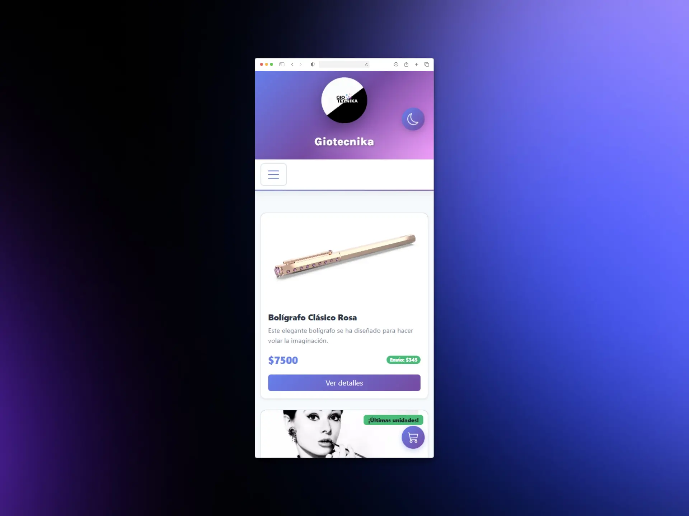

# 🛒 Giotecnika - E-commerce

<div align="center">


**E-commerce moderno y responsivo con React, Vite, Firebase y Dark Mode**

## 📸 Screenshots

### Light Mode


### Dark Mode


### Mobile


[Demo en vivo](https://giotecnika.netlify.app)

</div>

---

## ✨ Características Principales

### 🎨 Interfaz Moderna
- **Dark Mode** - Tema oscuro/claro con transiciones suaves y Context API
- **Glassmorphism** - Efectos de cristal esmerilado en componentes
- **Animaciones** - Transiciones fluidas y microinteracciones
- **Degradados animados** - Backgrounds con efectos visuales impresionantes
- **Responsive Design** - Adaptado a todos los dispositivos (mobile-first)

### 🛍️ Funcionalidades E-commerce
- **Catálogo de productos** - Grid responsivo con filtros por categoría
- **Detalle de producto** - Vista completa con información y stock
- **Carrito de compras** - Persistencia en localStorage
- **Checkout** - Formulario validado con react-hook-form
- **Búsqueda** - Sistema de búsqueda en tiempo real
- **Gestión de órdenes** - Almacenamiento en Firebase/Firestore

### 🔥 Tecnologías Avanzadas
- **Vite** - Build tool ultra rápido con HMR instantáneo
- **React Router v6** - Navegación declarativa
- **Context API** - Gestión de estado global (Carrito + Theme)
- **Custom Hooks** - useProducts, useProduct, useTheme
- **React Bootstrap** - Componentes UI modernos
- **SCSS** - Estilos con variables CSS y mixins
- **Firebase/Firestore** - Base de datos en tiempo real
- **React Hook Form** - Validaciones de formularios
- **SweetAlert2** - Alertas elegantes
- **React Icons** - Iconografía moderna

---

## 📦 Instalación

### Requisitos Previos
- Node.js 18+ (recomendado: v18.19.0)
- npm o yarn
- Cuenta de Firebase

### Paso 1: Clonar el repositorio
```bash
git clone https://github.com/tu-usuario/giotecnika.git
cd giotecnika
```

### Paso 2: Instalar dependencias
```bash
npm install
```

### Paso 3: Configurar variables de entorno
Crea un archivo `.env` en la raíz del proyecto:

```env
VITE_FIREBASE_API_KEY=tu_api_key
VITE_FIREBASE_AUTH_DOMAIN=tu_auth_domain
VITE_FIREBASE_PROJECT_ID=tu_project_id
VITE_FIREBASE_STORAGE_BUCKET=tu_storage_bucket
VITE_FIREBASE_MESSAGING_SENDER_ID=tu_sender_id
VITE_FIREBASE_APP_ID=tu_app_id
```

### Paso 4: Configurar Firebase
1. Crea un proyecto en [Firebase Console](https://console.firebase.google.com/)
2. Habilita **Firestore Database**
3. Crea dos colecciones:
   - `items` - Para productos
   - `ordenes` - Para órdenes de compra

### Paso 5: Iniciar el servidor de desarrollo
```bash
npm run dev
```

El proyecto estará disponible en `http://localhost:3000`

---

## 🎯 Scripts Disponibles

```bash
npm run dev          # Inicia servidor de desarrollo
npm run build        # Build para producción
npm run preview      # Preview del build de producción
```

---

## 📁 Estructura del Proyecto

```
libreria-giotecnika/
├── public/
│   └── favicon.ico
├── src/
│   ├── assets/              # Imágenes y recursos estáticos
│   │   └── logo.png
│   ├── components/          # Componentes React
│   │   ├── Cart/           # Carrito de compras
│   │   ├── Checkout/       # Proceso de pago
│   │   ├── Contacto/       # Formulario de contacto
│   │   ├── Footer/         # Pie de página
│   │   ├── Header/         # Encabezado y navbar
│   │   ├── Item/           # Card de producto
│   │   ├── ItemCount/      # Contador de cantidad
│   │   ├── ItemDetail/     # Detalle de producto
│   │   ├── ItemList/       # Lista de productos
│   │   ├── NavBar/         # Carrito widget
│   │   ├── Nosotros/       # Página sobre nosotros
│   │   ├── SearchResults/  # Resultados de búsqueda
│   │   └── ThemeToggle/    # Botón de dark mode
│   ├── Context/            # Context API
│   │   ├── CartContext.js  # Estado global del carrito
│   │   └── ThemeContext.js # Estado global del tema
│   ├── firebase/           # Configuración de Firebase
│   │   └── fireconfig.js
│   ├── hooks/              # Custom Hooks
│   │   ├── useProduct.js
│   │   └── useProducts.js
│   ├── router/             # Configuración de rutas
│   │   ├── AppRouter.js
│   │   └── PublicRoutes.js
│   ├── styles/             # Estilos globales
│   │   └── theme.scss      # Variables CSS para dark mode
│   ├── App.js              # Componente principal
│   ├── App.css             # Estilos globales
│   ├── index.js            # Punto de entrada
│   └── index.css
├── .env                    # Variables de entorno
├── .gitignore
├── index.html
├── package.json
├── vite.config.js          # Configuración de Vite
└── README.md
```

---

## 🎨 Características del Dark Mode

### Implementación
- **Context API** - Gestión de estado global del tema
- **localStorage** - Persistencia de preferencia del usuario
- **Variables CSS** - Más de 30 variables para colores y estilos
- **Transiciones suaves** - Cambio de tema sin parpadeos

### Paleta de colores

#### Light Mode
```scss
--bg-primary: #ffffff
--text-primary: #2d3748
--accent-primary: #667eea
--gradient: #667eea → #764ba2 → #f093fb
```

#### Dark Mode
```scss
--bg-primary: #1a202c
--text-primary: #f7fafc
--accent-primary: #5a67d8
--gradient: #1a1a2e → #16213e → #0f3460
```

---

## 🔥 Características Técnicas

### Performance
- ⚡ **Vite** - Build 10-100x más rápido que Webpack
- 🔄 **HMR instantáneo** - Hot Module Replacement sin recarga
- 📦 **Code Splitting** - Carga optimizada de componentes
- 🗜️ **Minificación** - CSS y JS minificados en producción

### UX/UI
- 🎭 **Animaciones CSS** - Transiciones suaves en todos los elementos
- 📱 **Mobile First** - Diseño optimizado para móviles
- ♿ **Accesibilidad** - ARIA labels y navegación por teclado
- 🌐 **SEO Friendly** - Meta tags y estructura semántica

### Seguridad
- 🔐 **Variables de entorno** - Credenciales protegidas
- ✅ **Validaciones** - Formularios con react-hook-form
- 🛡️ **Sanitización** - Inputs validados y sanitizados

---

## 🚀 Despliegue

### Vercel (Recomendado)
```bash
npm install -g vercel
vercel
```

### Netlify
```bash
npm run build
# Arrastra la carpeta dist/ a Netlify
```

### Firebase Hosting
```bash
npm install -g firebase-tools
firebase login
firebase init
firebase deploy
```

---

## 🛠️ Tecnologías y Librerías

| Categoría | Tecnología | Versión |
|-----------|-----------|---------|
| **Framework** | React | 18.2.0 |
| **Build Tool** | Vite | 5.4.21 |
| **Routing** | React Router DOM | 6.20.0 |
| **UI Framework** | React Bootstrap | 2.9.1 |
| **Styling** | Bootstrap | 5.3.2 |
| **Styling** | SASS | 1.69.5 |
| **Database** | Firebase | 10.7.1 |
| **Forms** | React Hook Form | Latest |
| **Notifications** | SweetAlert2 | 11.10.3 |
| **Notifications** | React Toastify | 9.1.3 |
| **Icons** | React Icons | 4.12.0 |

---

## 📝 Roadmap

### ✅ Completado
- [x] Catálogo de productos con filtros
- [x] Carrito de compras persistente
- [x] Dark mode completo
- [x] Sistema de búsqueda
- [x] Checkout con validaciones
- [x] Diseño responsive
- [x] Integración con Firebase

### 🔜 Próximas características
- [ ] Autenticación de usuarios
- [ ] Panel de administración
- [ ] Wishlist / Lista de deseos
- [ ] Valoraciones y reseñas
- [ ] Integración de pagos (Mercado Pago)
- [ ] Notificaciones por email
- [ ] Sistema de cupones/descuentos
- [ ] Filtros avanzados
- [ ] PWA (Progressive Web App)
- [ ] Multi-idioma (i18n)

---

## 🤝 Contribuciones

Las contribuciones son bienvenidas. Para cambios importantes:

1. Fork el proyecto
2. Crea tu Feature Branch (`git checkout -b feature/AmazingFeature`)
3. Commit tus cambios (`git commit -m 'Add: nueva característica'`)
4. Push a la Branch (`git push origin feature/AmazingFeature`)
5. Abre un Pull Request

---

## 📄 Licencia

Este proyecto está bajo la Licencia MIT. Ver el archivo `LICENSE` para más detalles.

---

## 👤 Autor

**Christopher Montes**

- 🌐 Website: [giotecnika](https://giotecnika.netlify.app)
- 📍 Ubicación: Argentina

---

<div align="center">

**⭐ Si te gustó este proyecto, dale una estrella en GitHub!**

</div>